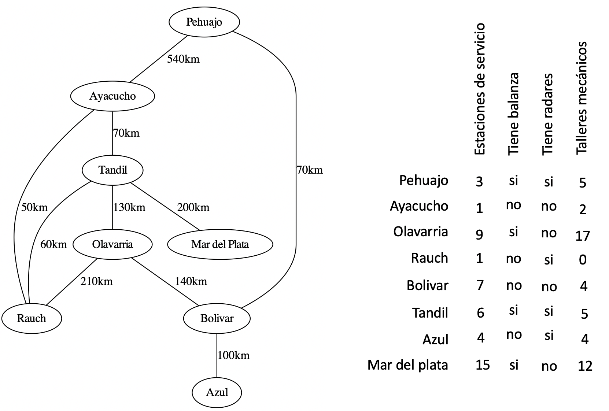
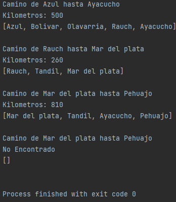

# Programacion3

## TP 1:
Utilizando su propia implementación de Lista desarrollada en este práctico, resuelva el siguiente problema: Dada una lista de entrada que contiene números de manera desordenada, se desea detectar todas las sub-secuencias (secuencias contiguas de numeros) que cumplan con las siguientes restricciones:

La suma de los elementos de la sub-secuencia debe ser menor o igual a un valor umbral dado por parámetro.
Los elementos de la lista solo pueden aparecer en una única sub-secuencia.
Las sub-secuencias encontradas deben ser de la mayor longitud posible, pero pueden estar compuestas de un único elemento.
El problema deberá retornar solo una lista con la suma de los elementos de cada una de las sub-secuencias que cumplan con las restricciones, respetando el orden en el cual fueron encontradas.

Por ejemplo:

```Lista de entrada = [] Valor umbral: 10
Lista de salida = [] // No devuelve nada (una lista vacía)

Lista de entrada = [1, 2, 3] Valor umbral: 10
Lista de salida = [6] // Todos los valores de la lista

Lista de entrada = [1, 2, 3] Valor umbral: 2
Lista de salida = [1, 2] // Dos elementos, el 3 como sub-secuencia supera el valor umbral.

Lista de entrada = [3, 5, 2, 7, 19, 14, 28] Valor umbral: 10
Lista de salida = [10, 7] // Los valores surgen de las sub-secuencias [3,5,2]; [7];

Lista de entrada = [3, 5, 4, 2, 7, 15, 14, 28] Valor umbral: 15
Lista de salida = [14,7,15,14] // Los valores surgen de las sub-secuencias [3,5,4,2]; [7]; [15];[14]
```

### Implementacion:
La implementacion para este problema fue realizada con una lista doblemente vinculada
circular, en la cual los Nodos tenían siguiente y anterior.

Se realizo un Service en el cual se encuentra la logica para resolver el problema.

Para correr los casos de test planteados en el problema ejecutar el main y saran impresos por pantalla.


## TP 2:
Implementar un árbol binario de búsqueda que provea, como mínimo, los métodos detallados en el Ejercicio 6 del práctico 2. Por simplicidad, se puede establecer que el árbol almacena números enteros
En cada método implementado incluir la complejidad temporal de dicho método. Una buena forma de hacerlo sería agregando un comentario previo a la declaración del método.
Métodos:

Object getRoot(), boolean hasElem(Object), boolean isEmpty(), void insert(Object),
boolean delete(Object), int getHeight(), void printPosOrder(), void printPreOrder(), void
printInOrder(), List getLongestBranch(), List getFrontera(), Object getMaxElem(), List
getElemAtLevel(int).

A la interfaz propuesta se le deben agregar dos funcionalidades adicionales:

Extender la salida obtenida por el recorrido pre-orden para incorporar los separadores ("-") que nos permiten entender la estructura correcta del árbol, sin ambigüedades (tema visto en la práctica).
Proveer al árbol de un método constructor que reciba un arreglo de números a insertar en el orden enviado, es decir, por ejemplo: ejecutar new Tree({15, 4, 1, 25, 50, 6, 7, 20, 5, 30}); generará el siguiente árbol.


Se debe entregar un proyecto/carpeta que contenga:

Todas las clases necesarias para compilar el árbol binario de búsqueda.

Una función o main donde se construya el árbol de ejemplo propuesto en la sección anterior y se realicen las siguientes operaciones:
```
// Se construye el árbol de ejemplo utilizando el constructor previamente mencionado
int[] valoresIniciales = new int[] {15, 4, 1, 25, 50, 6, 7, 20, 5, 30}
Tree miArbol = new Tree(valoresIniciales)

miArbol.printPreOrder()
System.out.println( miArbol.getMaxElem() );
System.out.println( miArbol.getHeight() );
System.out.println( miArbol.getLongestBranch() );
System.out.println( miArbol.getElementAtLevel(2) );
System.out.println( miArbol.getFrontera() );

miArbol.add(23)
miArbol.add(3)
miArbol.delete(6)
miArbol.delete(30)

miArbol.printPreOrder()
System.out.println( miArbol.getMaxElem() );
System.out.println( miArbol.getHeight() );
System.out.println( miArbol.getLongestBranch() );
System.out.println( miArbol.getElementAtLevel(2) );
System.out.println( miArbol.getFrontera() );

miArbol.add(65)
miArbol.delete(5)
miArbol.delete(15)
miArbol.add(55)

miArbol.printPreOrder()
System.out.println( miArbol.getMaxElem() );
System.out.println( miArbol.getHeight() );
System.out.println( miArbol.getLongestBranch() );
System.out.println( miArbol.getElementAtLevel(2) );
System.out.println( miArbol.getFrontera() );
```
### Implementacion:
La implementacion para este problema fue realizada con un arbol de busqueda binario. En los cuales los "nodos" eran Arboles.
Para la resolucion de cada metodo se ralizo de forma recursiva.
Para correr los casos de test planteados en el problema ejecutar el main y saran impresos por pantalla.


## TP 3:
Utilizando su propia implementación de Grafo desarrollado en este práctico, resuelva el siguiente problema:

Una empresa de transporte desea encontrar el camino más corto por la cual los camiones tienen que viajar de una ciudad a otra. Para esto, la empresa cuenta con un mapa con información de las ciudades y las rutas/caminos que conectan las distintas ciudades.

Para cada ciudad la empresa tiene registrada:

-La cantidad de estaciones de servicio que hay en la ciudad

-Si la ciudad posee balanza para realizar pesaje de camiones

-Si existen radares de velocidad en las cercanías de la ciudad

-La cantidad de talleres mecánicos en la ciudad

Por cada ruta la empresa tiene registrado:

-El par de ciudades que conecta

-La cantidad de kilómetros de la ruta

Se debe utilizar el grafo implementado para representar la red de conexiones entre las distintas ciudades del mapa. A continuación se muestra un ejemplo:

A partir de esta información, la empresa desea que le brindemos el camino más corto entre un par de ciudades dado. La distancia de un camino se calcula según la cantidad de kilómetros recorridos. Por ejemplo, para ir desde Azul a Ayacucho, la ruta más corta es: [Azul, Bolivar, Olavarría, Tandil, Ayacucho] con un total de 440 km de distancia a recorrer.

Sin embargo, la empresa nos hace saber que los controles de pesaje conllevan mucho tiempo, e introducen mucha demora en los viajes, por lo que se desea que el viaje planificado atraviese, como máximo, por una única ciudad con balanza para pesaje. En este punto, dado que Olavarría y Tandil cuentan ambas con balanza de pesaje, nos indican que el camino [Azul, Bolivar, Olavarría, Tandil, Ayacucho] no es aceptable.

Se debe proveer un servicio que, a partir de dos ciudades de origen y destino, calcule el camino más corto que atraviese como máximo una única ciudad con balanza de pesaje. La salida del servicio debe incluir la lista de ciudades en el orden que se las debe recorrer, junto con la cantidad total de kilómetros por recorrer.

Se debe proveer un main en el que se instancien las rutas y las ciudades indicadas en este ejemplo, y que solicite e imprima el resultado de ejecutar el servicio solicitado con las siguientes ciudades, considerando las operaciones entre los distintos llamados:
```
origen: Azul - destino: Ayacucho
origen: Rauch - destino: Mar del plata
origen: Mar del plata - destino: Pehuajo
eliminar la ciudad Ayacucho.
eliminar la ruta Tandil - Rauch
origen: Mar del plata - destino Pehuajo
```
### Implementacion:
La implementacion para este problema fue realizada con un Grafo genérico no dirigido y vertices con etiquetas.

Los vertices seran las ciudades y los Arcos las rutas siendo las etiquetas de los mismos los kilómetros.

Para la resolución de este problema se utiliza el algoritmo de busqueda DFS (Depth First Search o Busqueda en Profundidad), implementado en la clase llamada "DFS".
Luego se provee un Mapa en el cual esta contenido el Grafo y un Hashmap que contiene todas las ciudades.

Para ejecutar los casos de pruebas planteados en el problema ejecutar la clase Main y estos seran impresos por pantalla.

